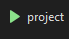

# prog_project

1. The program is meant to be run in Visual Studio 2019 or 2022.
2. The .Net Core version that it uses is 3.1, make sure that this is installed.
3. Once that is setup, run the project.sln file and it will open visual studio with the project.
4. Click on green arrow like the one shown: 
